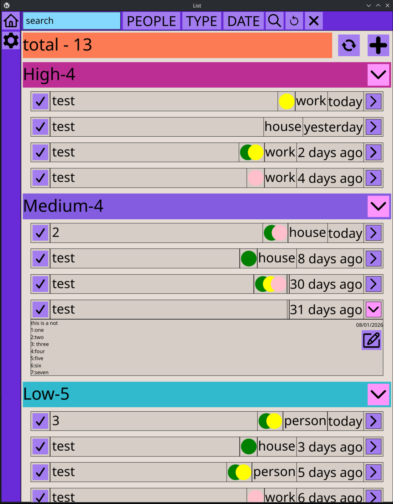
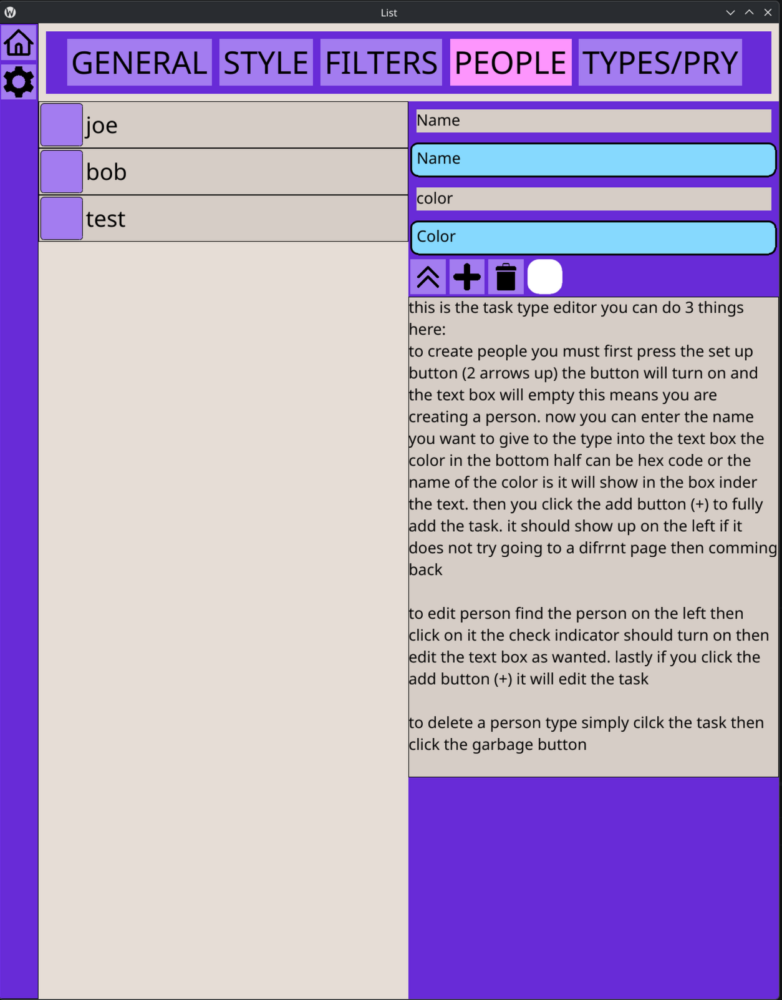
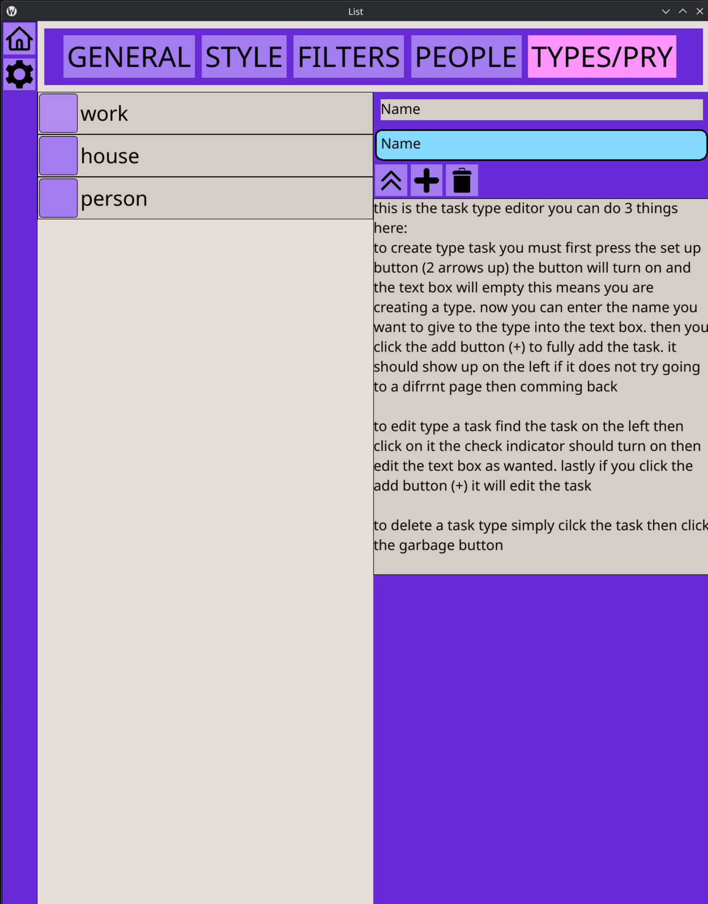
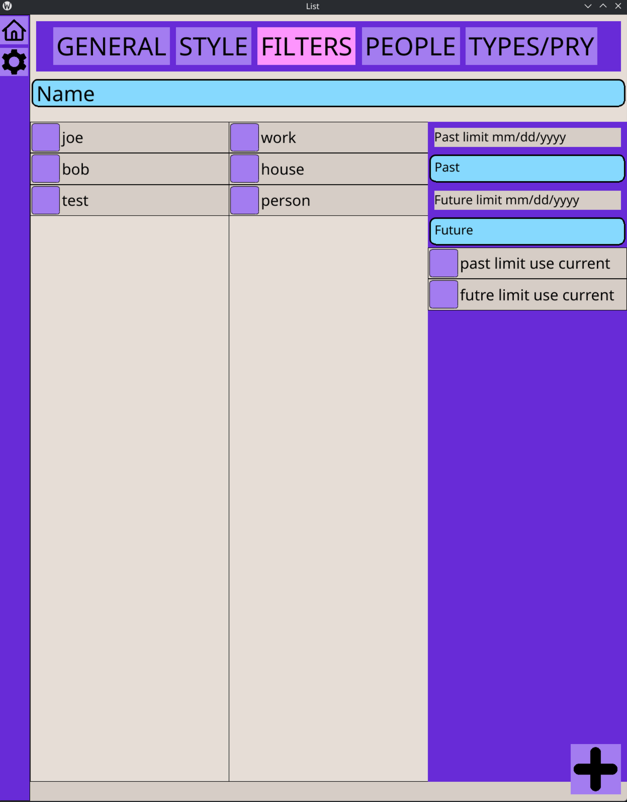
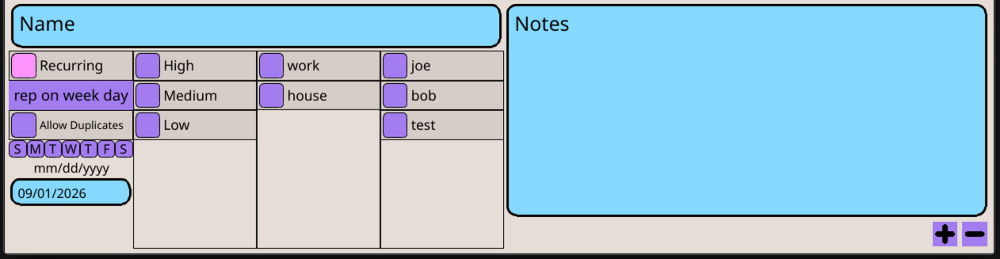

# list
this is a task list ment for simple house hold use that doesnt have alll the corpo slop most task list have

demo/totorial https://youtu.be/bYeSo8YZb2s

## index
* data base
* task data
* task item
* repeting typep
* duplicate
* pryoritys
* people
* type
* filtering
* create/edit tasks
* tetings
* futer goals
***
## data base
* it uses sqlite3 to edit a database
* the database is stored in you appdata folder under appdata/List/SQL/data.db
***
## task data
* name
  * stored as text and is used to destuinguised the task
* priority
  * stored as in int this will determin what section the task shows up in
* repeate type
  * stored an int 0-7 this decides how the repeate works {more info here}
* delay
  * stored as an int this is an anacompany vaiable for repeate
* date
  * stores as text in yyyy/mm/dd this is the date the task is due
* notes
  * stores as text this is just notes for the task
* people
  * store as text 
  * um this was probly the worst decition i made during this
  * each person stores an index and then this stores a string of thses intigers seperated by commoms
* type
  * stores as text the type just makes things better for sorting
***
## task item
the task item is desied to try to store as much info as you need without being over crouded 
* name
  * the name is set to fill any space the other items are not using
* people
  * each person has a color then the task will create circals for each person assined to the task
  * in the futre i want to store a profile picture insted of a color
  * there is a bug where if no person is selected to a sectoin it will make a weird empty box ill fix in an update soon
* type
  * this will simply display a the name of the task type
* time
  * this section will tell you how long ago / how long until the task is due
  * special casses
    * if the due date = 1 it will day tomarow
    * if the due date = 0 it will say today
    * if the due date = -1 it will say yester day
  * tasks are also ordered my due date
* drop down
  * on the far right side of the task there is drop down menu that opens underneath the task 
  * the drop down stores 3 things
    * notes
      * the drop down will scale wilth the notes
    * edit button
      * the edit button will open the edip menu
      * more about editing
    * due date
      * there is the due date in date fromate becouse idk i though it might be help full
***
## repeate type

there are 2 checks that the tasks do
each repeate type will check difrently
* check on refrech
  * every time the list refreshes it will check all tasks
  * if the refresh findes duplicates anything it will stop and restart the refresh so if a task needs to be updated multible times
* check on mark of
  * when a task is marked off the tasks is indivigualy checked for repeat

allow multi this is a vatiabe that will define if the task will remove its self on duplicate this is true if repete type is 2,5,7

* regular
  * this is stored as a 0
  * delay doent matter for this one
  * on refresh this doesnt nothing
  * on mark off this will do nothing
  * this is the only repete type that can be deleated
* rec on due
  * repeate on due date
    * will store as 1 of allow multi is false and 2 if it is true
    * delay is stored as an int that is how many days in between due dates
    * on the refresh check this task will check when the task is due then add the delay to that if this new date is is before or after todays current date
      * if the new date is after the task will duplicate its self to that date
    * on mark of when the task is marked of it will duplicate itself to task due date plus delay
* rec on comp
  * repeate on compleation 
    * this will store as a 3 and allow multi is not acesable for this task
    * delay is an int that stores how long before it should show back up after it is marked of 
    * this will be compleatly skiped on refresh
    * on mark of this task will duplicate to current date plus delay
* rec on week
  * repeate in a specific day/days of the week
    * this stores as a 4 if allowmulti is not selected and a 5 if allowmulti is selected
    * delay on this task is stored by convering the days of the week in to a 7 digit binary string where 0 is dont show up on that day and 1 is to show up on that day then the binary is converted into a int and stored in delay
    * on refresh this task will decode the in back in to binary then it will start at the due date and then add 1 until it finds a day that is a 1 then if that new data is pefore the current date it will duplicat its self to this date
    * the on mark off work exactly the same just it starts on the current date not the task due date
* rec on month
  * repeate on day of the month
    * this stores as a 6 if allow multi is off and a 7 if allow multi is on
    * delay is stored as an int that represents the day of the month to recure on so 1-28
    * on refreash it will take the current date then add 1 untill it finds a date with the month day = to delay then if the new date is before the curent date it will duplicate to the new date
    * on mark of it will take the current date then add 1 untill it finds a valid date then it will duplicate to then
***
## duplicate
in order for the reacuring tasks to work they need to duplicate them selfs

* if allow multi is true the code will set the old tasks repeate type to 0 so it will be a blank task that will not recure at all
* if allow multi id false it will just delete the old task
***
## pryoritys
the pryoritys will order the list to help you see what is the most importent
* pryority data 
  * color
    * each pryority has a color in order to make make it easier to see witch is the most importent
  * name
    * the names for the pryoritys are nameed High Meduim and low i think it is self explanitory why
  * count
    * each pryority hold how many tasks are in it and it deiplays that next to the name
  * drop down
    * the pryoritys can be expanded and colapsed for better visability
*  main bar
  * there is a pryority looking bar at the top of tha page this is used to show the total number of task on the list
* futre
  * i want to make it so that you can cusomize pryoritys inside the app 
***
## people

people are used in the list to easily assine tasks to people

* data
  * each person holds 3 things
    * index 
      * the index is used for a lot of things mainly that is how it is searched for
    * name
      * the name is to make it easier for people to read
    * color
      * this is the color that will show up on the task
    * reqHR
      * this is not used yet so dont worry about it
* edit
  * in the setting you can edit peoples informatino
  * you just click on the person then change the info then click the add button
  * this should update to all the task apon a reload but idk it works like 85% of the tim idk why
* delete
  * in the setting you can delete a person
  * you just click the person the the delete button
  * this also should update to all taks apon roload but idk 
* create
  * you can also create a peron in the settings you need to click the dubble arrows then you enter the info then click the add button
  * there is a color indicator
if you enter a ; or a ' in either text box it will not work so the code warns you if you try
***
## type

types are used to filter between difrent types of task like work,peronal,hobby,household,etc
these are like stupid simple in the back end btw

* data
  * id 
    * used to identify only in the sql
  * name 
    * the name is used for like every thing
* create/edit/delete 
  * its like mostly the same as how it works for people and i dont feel like wrighing all that again

***
## filter

the filters are veary usefull for sorting tasks
* backend
  * how it works
    * when a task is added to the page it first checks a function called is filter witch will return true if the filters alow the task to be showed
  * if any spot is blank it will not be counted in the filter
  * there are 4 diffrent ways items can be filtered
    * by name
      * it is a string
        * it will check if the string in the filter is a sub string of the task name if it is not it will return false
    * by person
      * it is a vector of int
        * it checks this vector of int with the vector of int in the task if nothing matches it will return false
    * by type
      * vector of strings
        * if the type of the task is not in the vector it returns false
    * by date
      * it stores 2 date variables //i used ctime my mistake
        * both full
          * if both slots in the vector are full it will check if the task ahead of the first time and behind the seconed time if not it returns false
        * first empty
          * it will check id it is ahead of the secontime then return false if true
        * second empty
          * it will check if it is before the first date then return fasle if true
  * if it make it through all of that with out returning false it will return true and the task will show up
* ui
  * select
    * name
      * just a stander text box 
        * i did make it so that if you click enter in the text box i wont read your imput becouse i kept acidently clicking enter and it was anoying
    * people
      * a simple drop down with check boxes
    * type
      * a simple drop down with check boxed
    * date
      * a drop down with 2 text boxes that you can put dates in to 
  * search
    * this is the magnifine glass and it it will send the selection to the code and apply the filters
  * reset
    * this will set the filters back to the defalts thern reload
  * clear
    * this will clear all filters then reload
* defats
  * the defalts filters can be set in the setting 
  * these will apply in start up
  * most of it is the same as in the main menu just perment ecept the date
    * use curent date
      * this will insted of setting the filters to a specific date it will automadicly st the filter the the current date
      * this works in the back end by replaceing the date with an X
*** 
## create/edit tasks

* create
  * there is a giant plus button in the top right
  * this will open a menu at the bottom
  * menu
    * name
      * you enter the name of the task you want can not be blank
    * recucuring
      * there like a lot
    * pryority
      * there is radio buttons where you select whatpryority you want to set to 
    * type
      * radio buttons where you select what type of task you want
    * people
      * you can check as many peole as you want to assine to the task
    * notes 
      * the entire right side is for notes
    * buttons
      * there is the add button
      * and a close button
* edit
  * each task stores the dex in it 
  * the button on the task to edit will open the task creater then insert all the date from the task you are currently in 
  * then you can edit anything then click the add button and the task updates
  * you alo have the option to delete from the editor witch will bypass all repeting stuff so it is the only way to perminitly remove a repeting task
***
## settings
the settings in another tab that you can switch too on the left side of the screen

most of it is unfishied though
***
## futre goals
these are things i am going to add in the futer
* hystory
* style settings
* pryority settings
* seerver stuff
* stop watch
* multible filter presets
* peple profile picturesmulti lever tasks
* persnal lister per person
***
